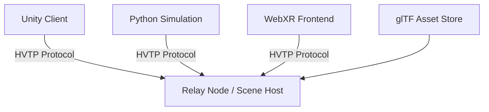

# 🛰️ Hyperverse Transfer Protocol (HVTP)

**HVTP** is an open application-layer protocol for the **real-time distribution, synchronization, and interaction of 3D virtual spaces** across heterogeneous systems.

> Designed to bridge virtual environments — not platforms.

HVTP enables **collaborative 3D environments** (CVEs) where users and systems can share, manipulate, and persist scenes using a unified, extensible **scene graph format** based on [glTF](https://www.khronos.org/gltf). It defines a protocol and runtime model that supports **live editing**, **multi-client presence**, and **distributed rendering** across engines, devices, and networks.

---

## ✨ Vision

We aim to create a **free, open, and decentralized system** for connecting spatial computing applications — from game engines to web renderers, from digital twins to simulation platforms.

HVTP is not a game engine. It’s not a platform. It’s a **real-time, interoperable bridge** between any spatial system that supports 3D scenes.

---

## 🔧 Features (Planned & In Progress)

### ✅ Core Capabilities

* 📡 **Application-layer protocol** (engine-agnostic)
* 🧠 **Shared scene graph model** using glTF
* 🔄 **Real-time updates & delta sync**
* 🔀 **Bi-directional synchronization** of scene changes
* 🌐 **Multi-client collaboration** and session awareness
* 📁 **Platform-neutral asset referencing** (IPFS, CDN, local, etc.)

### 🧱 Extensible Modules

* 🧍 **Identity & Presence** (DID-compatible avatar protocols)
* 🎭 **Avatar support** with glTF/VRM extensions
* 🔐 **Access control & permissioning** per scene or entity
* ⚡ **Scripting & behavior graphs** (planned support for Lua/WASM)
* 🛰️ **Teleportation & routing** between hosted virtual scenes
* 🪞 **Engine bridges** (Unity, Unreal, Godot, Three.js, Python, WebXR)

---

## 📦 Architecture Overview

HVTP follows a **client-server or peer-mesh model**, where each participant maintains a **local scene graph** and exchanges updates through a lightweight, binary or JSON-based messaging layer.



* **Scene updates** are diffed and propagated efficiently.
* **Clients** can subscribe to subgraphs or specific entities.
* **Sessions** track who is present, what is visible, and what has changed.

---

## 🗃️ Technical Stack

| Layer           | Tech / Spec                                         |
| --------------- | --------------------------------------------------- |
| Protocol Format | JSON / Binary (MessagePack or CBOR)                 |
| Scene Graph     | [glTF 2.0](https://www.khronos.org/gltf)            |
| Identity        | [DID Core](https://www.w3.org/TR/did-core/), OMI ID |
| Avatar Format   | VRM / glTF + extensions                             |
| Hosting / Sync  | WebSocket / QUIC / P2P / IPFS                       |
| Extensions      | Custom glTF extras, behavior scripts                |

---

## 🔍 Use Cases

* 🔧 **Collaborative 3D design tools**
* 🎓 **Immersive educational platforms**
* 🏙️ **Digital twins & smart cities**
* 🤝 **Cross-engine multiplayer frameworks**
* 🔬 **Scientific simulations**
* 🚀 **Virtual social or enterprise spaces**

---

## 🤖 AI Agents Integration

HVTP is designed not only for human users but also for **autonomous AI agents** capable of **observing, navigating, interacting with**, and even **modifying** the shared scene.

Modern virtual environments often involve non-human participants:

* 🧠 **NPCs powered by LLMs or behavioral models**
* 🤖 **Bots for QA testing or automated moderation**
* 📡 **Digital twins driven by real-world sensors or APIs**
* 🧑‍🚀 **Cognitive agents exploring and learning in CVEs**

HVTP treats these agents as **first-class participants** in the collaborative space, with their own presence, permissions, and communication channels.

---

## 📂 Repository Structure (Planned)

```
/protocol-spec     # Core protocol definition (messages, scenes, sessions)
/reference-server  # Node.js or Python relay node
/clients           # Unity, Web, Godot, Python integrations
/examples          # Multi-client scenes and demos
/docs              # Specification, diagrams, contributions
```

---

## 🚀 Getting Started (WIP)

We’re in **early development**. Want to get involved?

### 🔨 Clone & Contribute

```bash
git clone https://github.com/faustodc/HyperverseTransferProtocol
cd hvtp
```

### 📚 Read the Protocol Spec (coming soon)

* `/protocol-spec/hvtp.md`

---

## 🤝 Contributing

We welcome engine developers, protocol designers, WebXR enthusiasts, simulation researchers, and anyone passionate about open spatial computing.
* Submit PRs and RFCs
* Help us test engine bridges (Unity, Godot, etc.)

---

## 🧭 License

[MIT License](./LICENSE) — because freedom matters.

---

## ✉️ Contact & Credits

Built by the community of open 3D protocol advocates. Inspired by the work of the Open Metaverse Interoperability Group, the Khronos Group, and pioneers of collaborative virtual environments.
